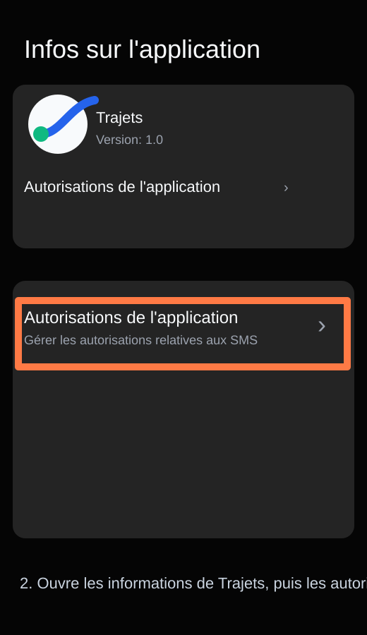
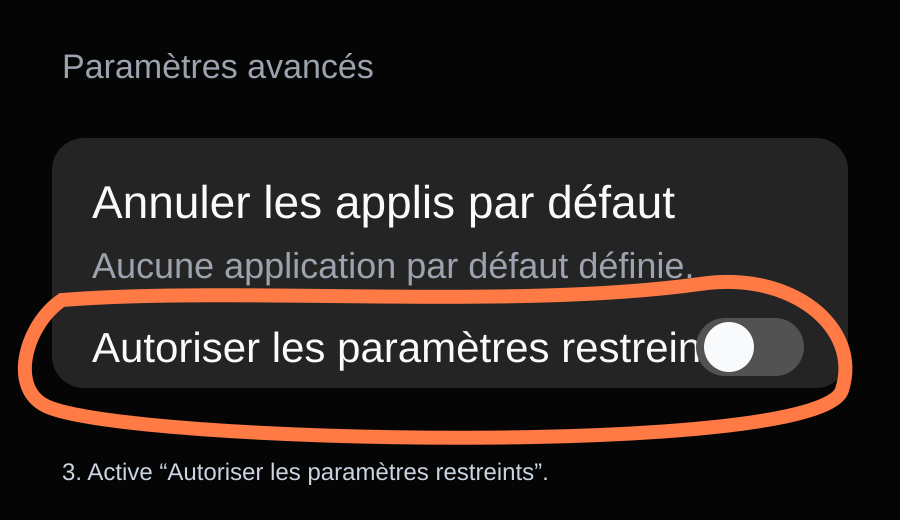
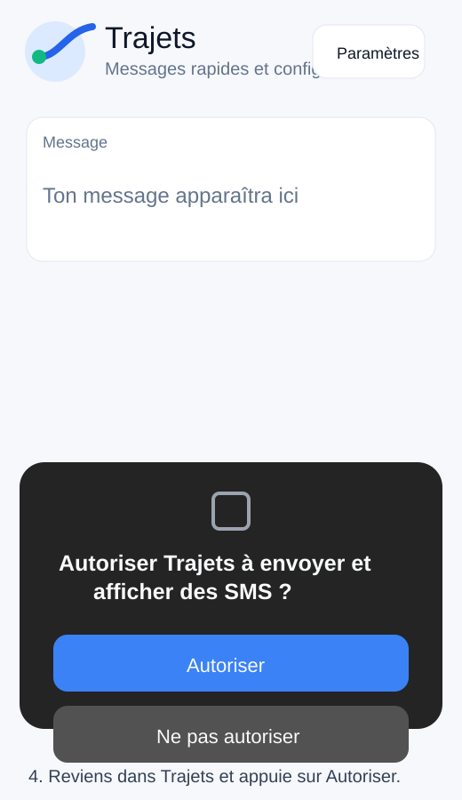

# Autoriser les SMS pour Trajets

Sur certains téléphones Android, une APK installée depuis GitHub peut être bloquée quand elle demande l'accès SMS. Il faut d'abord autoriser les paramètres restreints pour l'application.

## 1. Ouvrir les infos de l'application

Appuie longtemps sur l'icône **Trajets**, puis touche le bouton **infos**.

## 2. Ouvrir les autorisations

Dans **Infos sur l'application**, ouvre **Autorisations de l'application**.

## 3. Autoriser les paramètres restreints

Dans le menu en haut à droite ou dans les paramètres avancés, active **Autoriser les paramètres restreints**.

## 4. Autoriser les SMS dans Trajets

Reviens dans Trajets. Quand Android demande l'autorisation SMS, appuie sur **Autoriser**.

Si l'option n'apparaît pas, ferme les paramètres, relance Trajets, tente d'envoyer un SMS une fois, puis retourne dans les infos de l'application.
